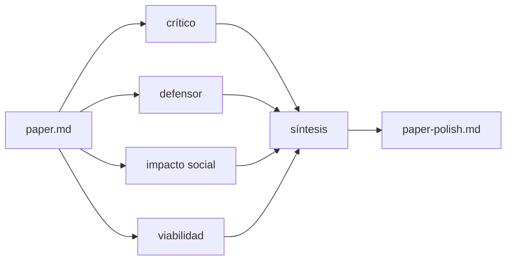

# rsl-polish-paper

## Goal

Polish an existing **`paper.md`** (borrador expandido de la Introducción) via a 4-agent debate and save:

| File | Role |
|------|------|
| **`paper-polish.md`** | Entregable limpio para el documento (APA 7) |
| **`paper-debate.md`** | Traza del debate (Mermaid + turnos); no va al paper |

Do **not** create the introduction from scratch (`rsl-make-paper`). Do **not** overwrite `paper.md` unless the user explicitly asks.

## Paths (required)

```text
docs/[titulo-breve]/
  topic.md / informe*.md / ficha.md   (contexto interno — NUNCA citarlos en el paper)
  paper.md              (input — borrador largo con §1.1…; de rsl-make-paper)
  paper-polish.md       (output limpio — THIS skill)
  paper-debate.md       (output debate — THIS skill)
  RSL/PDF/  RSL/MD/
  graphify-out/         (lookup only)
```

## Invoke

```text
Usa rsl-polish-paper sobre docs/ia-inclusion-cognitiva-software/paper.md
```

Or the folder `docs/ia-inclusion-cognitiva-software/`. If omitted → ask for path under `docs/`.

## Division of labor: `paper.md` vs `paper-polish.md`

| | `paper.md` | `paper-polish.md` |
|---|------------|-------------------|
| Rol | Borrador de trabajo: puedes explayarte, numerar 1.1/1.2, tablas auxiliares | Texto listo para el documento |
| Citas | APA 7 in-text; **prohibido** `topic.md`, panel, GO_*, rutas de repo | Igual |
| Estructura visible | Outline UTP con subsecciones numeradas (ok) | **Sin** `### 1.1`, `### 2.3`, etc. |
| Extensión | Largo / masticado | Más corto y fluido; la lógica del outline vive **dentro** de la Introducción como párrafos |

El outline UTP (contexto, problema, justificación, objetivo, organización) **pertenece a la Introducción**, pero en `paper-polish.md` se **mastica en párrafos** encadenados, no como checklist de encabezados.

## Output template (`paper-polish.md`) — required

```markdown
# [Título de la RSL]

**Tema.** …
**Problemática.** …
**Objetivo.** …

## Introducción

[Párrafos fluidos. Cubrir, sin subtítulos numerados, el arco:]
- Contexto: definiciones; lo que se sabe (citas); disputas actuales
- Problema: tendencias / discrepancias / vacíos (evidencia); contraste actual vs deseada; qué se propone estudiar
- Justificación: por qué el tema; utilidad de resultados; para quién; por qué una RSL
- Objetivo: unión problema ↔ lo ya hecho en fronteras; salvaguarda ética breve
- Organización: cómo se estructura el resto de la revisión (1–2 párrafos)

## Referencias

[Solo las **3 RSL ancla** de la ficha, formato APA 7 completo, orden alfabético.]
…
```

### APA 7 (hard rules)

- Citas in-text: `(Autor, año)` / Autor (año); DOI como URL `https://doi.org/…` en la lista.
- **Prohibido** en `paper-polish.md` y en el cuerpo citable de `paper.md`: `` `topic.md` ``, `informe.md`, nombres de skills, “panel”, “GO_con_cambios”, rutas de archivos del repo.
- Usar `topic.md`/ficha solo como **insumo interno** del agente.
- Referencias finales: las **3 RSL ancla** (no mezclar fronteras Xu/Paiva en la lista salvo que el usuario lo pida; esas van solo in-text si se mencionan).
- Corregir errores de ficha si Graphify/DOI lo demuestran (p. ej. número de artículo).

## Critic role

Real contribution, no false claims, correct APA citations, coherence with topic/ficha frontiers. Does **not** mean discard the paper.

Extra lenses in the debate (for `paper-debate.md`):

- **Revisor de contenido:** ¿por qué este párrafo aquí y no allá? ¿continuidad? ¿sentido con el tema?
- **Revisor de forma/gramática:** conectores, repeticiones, tono académico.
- Los 4 roles estándar responden; el debate queda en `paper-debate.md`, **no** en `paper-polish.md`.

## Writing style (`paper-polish.md`)

Spanish académico-profesional; conectores; párrafos cohesivos; APA 7. Sin tono de chat ni andamiaje de agentes.

## Procedure (required)

1. Read `paper.md` + ficha (`informe-polish.md` | `informe.md` | `ficha.md`) + `topic.md` if present (**internal only**).
2. **Graphify lookup** (do not refresh):
   ```bash
   graphify query "<claim or frontier>" --graph docs/[titulo-breve]/graphify-out/graph.json
   ```
   Prefer `RSL/MD/` via locators; avoid loading full PDFs.
3. Launch in parallel: `critico-rsl`, `defensor-rsl`, `impacto-social-rsl`, `viabilidad-negocio-rsl`.
4. Shared prompt: package +  
   “Evalúa/mejora esta INTRODUCCIÓN. Responde en español con el formato de tu rol. Exige APA 7, citas reales, coherencia con fronteras de la ficha, problema/justificación/objetivo unidos. **Prohibido** citar topic.md/panel/rutas. El entregable limpio será párrafos fluidos + 3 refs APA ancla.”
5. Brief synthesis in chat (2–4 líneas).
6. Write **`paper-debate.md`**: Mermaid del flujo de agentes + turnos (preguntas de revisor contenido/forma + respuestas).
7. Write **`paper-polish.md`** con el template de arriba (tema / problemática / objetivo → Introducción fluida → Referencias APA 7 de las 3 RSL).
8. List main changes; note missing PDFs / Graphify gaps.

## `paper-debate.md` template

```markdown
# Debate — paper polish — [titulo-breve]

## Flujo



## Turnos
### Crítico / revisor de contenido
…
### Defensor
…
### Impacto social
…
### Viabilidad
…
### Forma / gramática (si aplica)
…
### Síntesis aplicada a paper-polish.md
…
```

## Forbidden

- Creating `paper.md` from scratch (`rsl-make-paper`).
- Overwriting `informe*.md` / `topic.md` / `paper.md` (salvo pedido explícito).
- Subsecciones numeradas tipo `1.1` / `2.3` en **`paper-polish.md`**.
- Citar `topic.md`, panel, skills o rutas en el texto del paper.
- Referencias inventadas o DOI falsos.
- Refreshing Graphify unless the user asks.
- Dumping full PDFs when Graphify/`RSL/MD` exists.
- Saving outside `docs/[titulo-breve]/`.
- Meter el debate crudo dentro de `paper-polish.md`.
