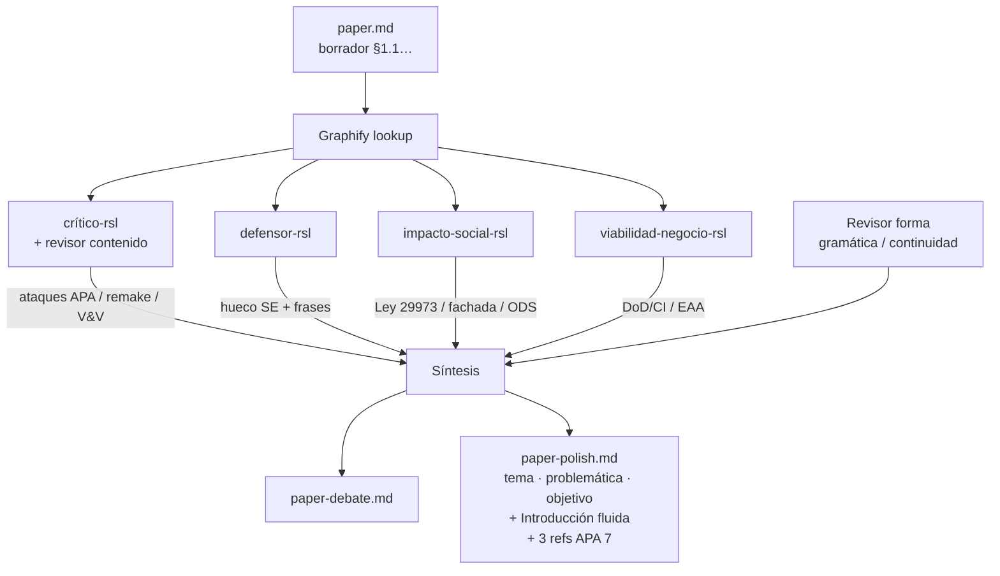

# Debate — paper polish — ia-inclusion-cognitiva-software

Traza interna del pulido. **No** forma parte del documento académico. Entregable limpio: `paper-polish.md`.

## Flujo

## Turnos

### 1. Crítico / revisor de contenido

**Preguntas al texto (como revisor Scopus):**

1. ¿Por qué Ley 29973 y “PCM/WCAG 2.2” aparecen sin Resolución N.º 001-2025-PCM/SGTD ni acotar que WCAG ≠ mandato COGA?
2. ¿Por qué el núcleo narrativo carga diseño/personalización si la celda aguda es V&V × GenAI × COGA? ¿Eso no acerca el paper a Xu (2025)?
3. ¿Por qué el objetivo es una oración-lista de fronteras en lugar de objetivo primario + subordinados?
4. ¿Por qué se cita ``topic.md`` / “panel” / GO_con_cambios en una Introducción? (prohibido en APA / documento).
5. ¿Dónde está Bi et al. (2022) como ancla de práctica SE frente al sesgo solo-Chemnad?
6. ¿Continuidad §1.2 → §2.1: Aljedaani se lee como “ciclo de vida SE” cuando es LLM×web task-level?
7. Perry: ¿artículo 207 o 370? La cadena bibliográfica debe cuadrar con el DOI.

**Veredicto de riesgo:** medio (sube si no se ancla V&V, normas primarias y Bi).

### 2. Defensor

**Respuestas:**

1. El aporte no es “IA + neurodivergencia” (ocupado), sino taxonomía **condición × técnica IA × fase SE × métrica** con énfasis V&V/COGA.
2. Chemnad / Perry / Aljedaani / Xu / Paiva dejan ese hueco explícito (qué cubren / qué no).
3. Insertar frases de delimitación tras cada ancla; Bi (2022) refuerza sin diluir.
4. Frase puente problema → justificación → objetivo (taxonomía + columna DoD/CI).
5. Mantener título SE; no afirmar “ausencia total de papers”.

**Contra-pregunta al crítico:** ¿qué RSL 2024–2026 ya codifica la taxonomía cuádruple exportable a DoD/CI?

### 3. Impacto social

**Exigencias al polish:**

1. Titulares de derecho (Ley 29973 arts. 15, 21, 23), no solo “perfiles técnicos”.
2. Resolución 001-2025-PCM/SGTD: motiva WCAG; no garantiza inclusión cognitiva → riesgo de fachada.
3. ODS 10.2 y 4.5/4.a como horizonte, no causalidad.
4. Nombrar ableísmo metodológico y anti-medicalización en el cuerpo, no solo al final.

### 4. Viabilidad de negocio

**Exigencias:**

1. Artefacto industrial = columna taxonomía → automatizable en CI / juicio experto / usuarios COGA.
2. EAA / EN 301 549 como contexto de **riesgo de fachada**, no brochure de compliance.
3. No prometer certificación ni VPAT.

### 5. Revisor de forma / gramática / continuidad

**Hallazgos sobre el borrador `paper.md` y el primer polish numerado:**

| Hallazgo | Acción en `paper-polish.md` |
|----------|----------------------------|
| Subtítulos 1.1–2.4 leen a checklist UTP, no a Introducción de paper | Eliminar numeración; un solo `## Introducción` |
| Meta-citas a panel / `topic.md` | Borrar; reformular como argumento |
| Repetición “sesgo visual” en tres bloques seguidos | Compactar en un arco: evidencia → tensión → problema |
| Objetivo kilométrico | Partir en primario + subordinados, luego unir al problema |
| Mezcla DOI crudos en prosa | Preferir (Autor, año); DOI solo en Referencias |
| “ficha UTP” / andamiaje interno | Fuera del entregable |

**Continuidad párrafo a párrafo (regla aplicada):** cada párrafo debe (a) anclar en el anterior con conector, (b) aportar una idea nueva, (c) no adelantar utilidad industrial antes del vacío científico sin puente.

### 6. Síntesis aplicada a `paper-polish.md`

1. Cabecera: solo **Tema / Problemática / Objetivo**.
2. Introducción fluida (sin 1.1…): definiciones → 3 anclas + fronteras in-text → tensiones + Perú/EAA acotados → problema V&V-first → justificación + utilidad DoD/CI → objetivo unido → organización breve → ética.
3. **Referencias:** solo las 3 RSL ancla en APA 7 (Aljedaani & Mollik, 2026; Chemnad & Othman, 2024; Perry et al., 2024 art. 370).
4. Fronteras Xu, Paiva, Bi: in-text si aportan; **no** en la lista de Referencias del polish (salvo pedido explícito).
5. Debate completo permanece aquí; el paper queda limpio.

## Fuentes internas usadas en el debate (no citar en el paper)

- `paper.md`, `informe-polish.md`, `topic.md` (insumo)
- Graphify tema: `graphify-out/graph.json` (169 nodos; Chemnad, Perry, Aljedaani)
- PDF locales ancla: sí · Xu/Paiva/Bi: DOI sin PDF local en el tema
