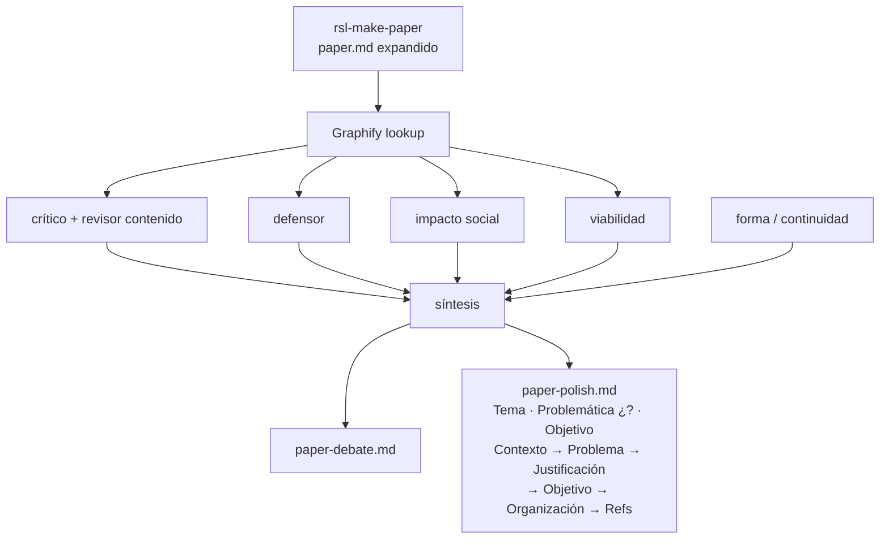

# Debate — paper polish — ia-inclusion-cognitiva-software

Traza interna. Entregable limpio: `paper-polish.md`.

## Flujo

## Turnos

### Crítico / revisor de contenido

- `paper.md` es bodega correcta (numerada); el polish **debe aplanar** a H2 fijos.
- Problemática ya es ¿…? en make; en polish poner V&V al frente en la pregunta.
- Evitar ciclar Chemnad/Perry/Aljedaani en todos los bloques: una vez en Contexto; Problema = vacío; Justificación = utilidad.
- Bi: no citar solo 7 % vs 37 % omitiendo auditivo; en polish, formulación cualitativa.
- Quitar meta-texto (`rsl-polish-paper`, borradores).
- Regulación: 1–2 frases; WCAG ≠ COGA.

### Defensor

- Hueco = taxonomía SE (fase × métrica × COGA), no remake de las tres anclas.
- Frases “qué no cubre” por ancla en Contexto.
- Problemática-pregunta en cabecera + reiteración breve en El problema.
- Plan B: mapping si celda V&V×GenAI×COGA sale vacía.

### Impacto social

- Conservar Ley 29973, Res. 001-2025-PCM/SGTD, ableísmo/fachada, ODS sin causalidad, salvaguarda — en forma corta.

### Viabilidad

- Columna taxonomía→DoD/CI obligatoria; EAA como riesgo de fachada, no brochure.

### Forma / gramática / continuidad (validación)

**Veredicto:** pass (tras reescritura masticada).

| Chequeo | Resultado |
|---------|-----------|
| Párrafos ≤ ~4 oraciones | OK — Contexto ya no es pared de anclas |
| Continuidad Contexto→Problema | OK — “De esas tensiones nace la pregunta…” |
| Continuidad Problema→Justificación | OK — vacío SE → por qué el tema / RSL |
| Continuidad Justificación→Objetivo | OK — “En respuesta a la pregunta…” |
| Sin eco cíclico de las 3 RSL | OK — anclas fuertes en Contexto; luego selectivas |
| Sabor IA (listas A;B;C / tríos forzados) | Reducido — se cortaron enumeraciones densas |

**Correcciones aplicadas:** partir Contexto; una frase por ancla; pregunta breve en Problema (eco, no copia del header); Justificación y Objetivo más cortos; Organización a 1 párrafo.

### Síntesis aplicada

1. `paper.md` = bodega larga.
2. `paper-polish.md` = masticado, fluido, H2 ordenados, Problemática ¿…?.
3. Revisor de forma debe volver a fallar el polish si reaparecen paredes o listas disfrazadas.
