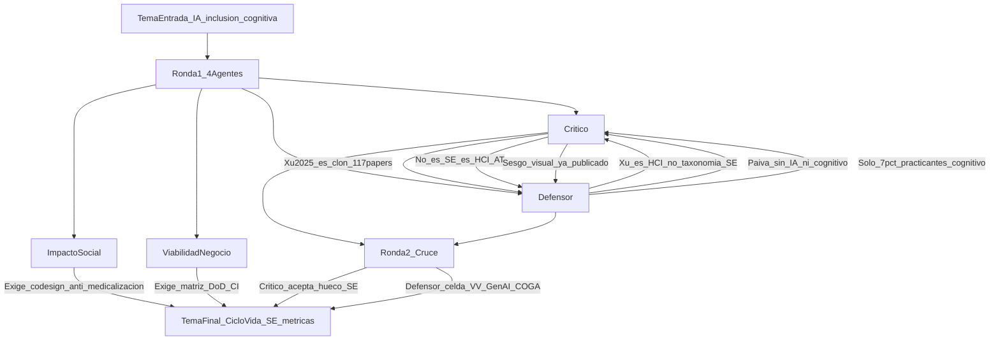

# Veredicto del panel — IA e inclusión cognitiva / neurodivergencia

## BLOQUE_TEMA (entrada)
- Título: Inteligencia artificial para el diseño y evaluación de software inclusivo orientado a personas con discapacidad cognitiva y neurodivergencia: una revisión sistemática de la literatura
- Problemática: ¿Cómo se han aplicado técnicas de IA en el diseño, adaptación y evaluación de software para mejorar la inclusión digital de personas con discapacidad cognitiva y neurodivergencia, y qué vacíos metodológicos persisten?
- Objeto de estudio: Modelos y prácticas de IA en desarrollo/evaluación de sistemas (interfaces adaptativas, personalización, soporte cognitivo, pruebas de usabilidad/accesibilidad) dirigidos a usuarios con discapacidad cognitiva o neurodivergencia.
- Tópicos (3): discapacidad cognitiva / neurodivergencia · IA · diseño y evaluación de software
- Carrera/contexto: Ingeniería de Software (Perú / UTP)
- Notas: Aporte esperado — taxonomía tipo × técnica IA × fase SE × métricas; contraste frente al sesgo hacia discapacidad visual.

## Veredicto global
**GO_con_cambios**  
Riesgo de rechazo (Scopus/revisor externo): **medio** (alto si se presenta el título original sin afilar; medio tras el recorte SE acordado en ronda 2)

## Diagrama del debate

## Fuentes consultadas (panel)
- Xu et al. (2025), scoping 117 papers HAI/neurodivergencia — DOI 10.1080/17483107.2025.2579822
- Perry et al. (2024), npj Digital Medicine — DOI 10.1038/s41746-024-01355-7
- Chemnad & Othman (2024), Frontiers AI — DOI 10.3389/frai.2024.1349668
- Paiva, Freire & Fortes (2020/21), J. Systems and Software — DOI 10.1016/j.jss.2020.110819
- Bi et al. (2022), TOSEM — DOI 10.1145/3503508
- SLR LLM–web accessibility (arXiv 2605.13873); ICITDA 2025; López & Pereira (2024) WCAG
- W3C COGA / Making Content Usable; WAI-Adapt; EN 301 549; European Accessibility Act 2025
- Perú: Ley 29973; Lineamiento SGTD/PCM WCAG 2.2; Sello de Accesibilidad Digital
- Mercado: Cognitive Accessibility Software / Neuroinclusive UX (Stratistics MRC / GII); Salesforce A11Y Agent; IBM Watson a11y

## Ataques del crítico
- El título original es casi clon del scoping Xu et al. 2025 (117 papers) sobre diseño inclusivo/adaptativo humano–IA para neurodivergencia.
- Corpus oceánico: cognitiva + neurodivergencia + IA + diseño/evaluación mezcla HCI, AT, educación y clínica.
- El “aporte” taxonomía + sesgo visual ya está parcialmente ocupado (Chemnad 2024; COGA vs WCAG).
- Riesgo de vender HCI/AT como Ingeniería de Software.
- “Identificar vacíos metodológicos” ya es estribillo de revisiones 2024–2026.
### Fuentes del crítico
- DOI 10.1080/17483107.2025.2579822; 10.1038/s41746-024-01355-7; 10.3389/frai.2024.1349668; arXiv 2605.13873; ICCHP/Springer a11y en proceso SE; política PCM Perú; EAA / EN 301 549.

## Defensa
- Xu 2025 es HCI/AT (dominios, engagement, ética), no taxonomía condición × técnica IA × **fase SE** × **métricas SE**.
- Paiva et al. cubren a11y en SE sin IA ni foco cognitivo.
- Bi et al.: solo 7% de practicantes priorizan discapacidad cognitiva vs 37% visual — motiva el contraste.
- Primarios SE recientes (p. ej. MultiTEA) aún no sintetizados bajo esa matriz.
### Fuentes del defensor
- DOI 10.1080/17483107.2025.2579822; 10.1038/s41746-024-01355-7; 10.1016/j.jss.2020.110819; 10.1145/3503508; 10.1007/s11042-025-20811-4; MDPI Behav. Sci. a11y cognitiva web.

## Impacto social
- Relevancia **alta**: CDPD art. 9, ODS 4/10, Ley 29973, lineamiento PCM WCAG 2.2, ~3,2 M personas con discapacidad (INEI/CONADIS).
- Beneficio de la RSL: taxonomía y métricas COGA, no producto clínico.
- Riesgos: ableísmo algorítmico, medicalización, vigilancia de perfiles, sesgo Global North, cumplimiento WCAG de fachada.
### Fuentes
- W3C COGA; UNESCO inclusión digital; gob.pe lineamiento plataformas accesibles; Ley 31814 (IA); AI Now / ética IA y discapacidad.

## Viabilidad empresarial
- Demanda **media**: EAA 2025, EN 301 549, WCAG 2.2, mercado cognitive a11y en crecimiento; gasto enterprise aún sesgado a a11y visual/ARIA.
- Exigencia: artefacto industrial (matriz + métricas + Definition of Done), no mapa literario.
### Fuentes
- GII/Stratistics cognitive accessibility & neuroinclusive UX; MarketIntelo digital a11y software; Salesforce A11Y Agent; IBM Watson a11y; Google NAI; PCM Perú.

## Debate entre agentes

### Choques principales
- **Crítico vs Defensor:** ¿Xu 2025 mata el tema? Crítico: sí si se presenta el título original. Defensor: no, si el objeto es SE (fases + métricas). En ronda 2 el crítico **acepta el hueco SE** (Xu no codifica SDLC ni métricas de calidad de software) y baja el riesgo a medio con condiciones.
- **Impacto vs Negocio:** impacto exige co-diseño, anti-medicalización y eje LATAM; negocio exige matriz operable en CI/CD o DoD. Compatibles si la taxonomía incluye “qué automatizar vs qué exige usuario real”.

### Preguntas cruzadas
1. **Crítico → Defensor:** Tras Xu 2025, ¿qué celda de la taxonomía queda vacía?
   - **Respuesta (ronda 2):** neurodivergencia/cognitiva × **V&V/testing/auditoría** × **GenAI como evaluador/copiloto QA** (no producto terapéutico). Las SLR LLM–WCAG cubren lo estructural/visual; COGA queda débil.
2. **Defensor → Crítico:** ¿Xu ya codificó fases SE y métricas de software?
   - **Respuesta (ronda 2):** **No.** Venue AT/HCI; cinco temas de interacción; métricas clínicas/UX, no defectos a11y en pipeline SE. Hueco SE aceptado con condiciones.
3. **Impacto social exige:** salvaguarda ética (co-diseño o análisis de su ausencia), anti-medicalización, privacidad/sesgo, transferibilidad Global South/Perú.
4. **Viabilidad exige:** matriz tipo × técnica × fase SE × métrica insertable en DoD/CI, con límites de lo que la IA no cubre.

### Recomendaciones cruzadas
- El crítico obliga a: excluir HCI/AT puro; matriz cuádruple; pilot de corpus; anclar RQs a artefactos SE.
- El defensor propone conservar: contraste vs sesgo visual + lente SE; afilar a evaluación/V&V con GenAI como núcleo extraíble.
- Impacto impone: derechos/COGA, no “corregir” al usuario.
- Negocio impone: salida decision-ready para PM/QA/compliance (Perú WCAG 2.2 + EAA).

## 5 mejoras mínimas antes de presentar
1. Sustituir el título “software inclusivo” genérico por **ciclo de vida SE + accesibilidad cognitiva + IA**.
2. Declarar frontera vs Xu 2025 / Perry 2024 / Chemnad 2024 en tabla de solapamiento.
3. Estratificar poblaciones (TEA, TDAH, DI, dislexia, etc.) en el protocolo; no caja negra “neurodivergencia”.
4. Priorizar extracción de **métricas SE/COGA** y fase (con énfasis en verificación/evaluación).
5. Incluir salvaguarda ética + artefacto industrial mínimo (matriz/checklist).

## Tema final propuesto
*(Consenso tras debate ronda 1 + ronda 2. Un solo planteamiento. Listo para `rsl-make-report`.)*

### Título final
Inteligencia artificial en el ciclo de vida del software para accesibilidad cognitiva y neurodivergencia: técnicas, fases de ingeniería y métricas de evaluación — una revisión sistemática de la literatura

### Problemática final
¿Cómo se han integrado técnicas de inteligencia artificial en las fases del ciclo de vida del software (con énfasis en diseño, personalización y, sobre todo, verificación/evaluación) orientadas a usuarios con discapacidad cognitiva o neurodivergencia, qué métricas de evaluación se emplean, y qué vacíos metodológicos persisten frente al sesgo de la literatura y la práctica hacia la accesibilidad sensorial/visual y frente a revisiones HCI/AT ya existentes?

### Objeto de estudio / objetivo final
Sintetizar evidencia primaria sobre técnicas de IA aplicadas a artefactos y procesos de Ingeniería de Software (requisitos/diseño de interfaces adaptativas, personalización en runtime, testing/V&V/auditoría de accesibilidad) para perfiles cognitivos o neurodivergentes, produciendo una taxonomía **condición × técnica de IA × fase SE × métrica de evaluación**, con contraste explícito respecto al sesgo visual/WCAG-duro y con exclusión de intervenciones HCI/AT clínicas o educativas sin componente de proceso SE.

### Tópicos (3) finales
1. Accesibilidad cognitiva / neurodivergencia (poblaciones estratificadas; COGA)
2. Inteligencia artificial / GenAI aplicada a artefactos del ciclo de vida del software
3. Fases SE y métricas de diseño, personalización y verificación/evaluación

### Por qué se eligió este recorte
- El título original colisiona con Xu et al. 2025; el consenso exige **ángulo SE**, no otra síntesis de interacción inclusiva.
- El crítico aceptó el hueco SE tras verificar que Xu no codifica SDLC ni métricas de calidad de software.
- El defensor aportó la celda más aguda (V&V × GenAI × cognitiva) como núcleo de extracción, sin impedir cubrir diseño/personalización cuando haya evidencia SE.
- Impacto y negocio legitiman el tema (derechos + compliance EAA/WCAG 2.2/Perú) solo si hay salvaguarda ética y artefacto accionable.

### Aporte científico defendible (una frase)
Una taxonomía SE-centrada (condición × técnica IA × fase × métrica) de accesibilidad cognitiva/neurodivergencia asistida por IA, delimitada frente a revisiones HCI/AT y al sesgo visual/WCAG.

### Alcance y exclusiones
- **Incluye:** estudios con técnica de IA explícita + contribución a diseño/desarrollo/evaluación de software; métricas COGA/usabilidad cognitiva o de calidad SE; contraste con a11y visual cuando aparezca.
- **Excluye:** robots sociales / ITS / screening clínico como producto principal sin proceso SE; demos sin evaluación; accesibilidad solo visual/auditiva/motora salvo contraste; HCI/AT puro de rehabilitación sin artefactos de ciclo de vida.

### Riesgos residuales y cómo mitigarlos
- Solapamiento residual con Xu 2025 → tabla de solapamiento RQ-a-RQ en el protocolo.
- Corpus fino en la celda V&V×LLM×COGA → permitir fases SE adyacentes documentadas; no forzar solo LLM si el pilot muestra vacío extremo.
- Paperware → entregar matriz + checklist DoD como resultado de la síntesis.
- Ética → co-diseño o registrar su ausencia; anti-medicalización; privacidad.

### Criterios de éxito ante un revisor Scopus
- Diferenciación demostrada vs Xu 2025, Perry 2024, Chemnad 2024 y Paiva 2020.
- Protocolo PRISMA; bases IEEE/ACM/Scopus; exclusiones HCI/AT puro.
- Taxonomía cuádruple operativa; métricas definidas; discusión COGA vs WCAG.
- Alineación explícita con Ingeniería de Software (no solo “inclusión digital”).

### Listo para siguiente skill
`rsl-make-report` sobre `docs/ia-inclusion-cognitiva-software/`
